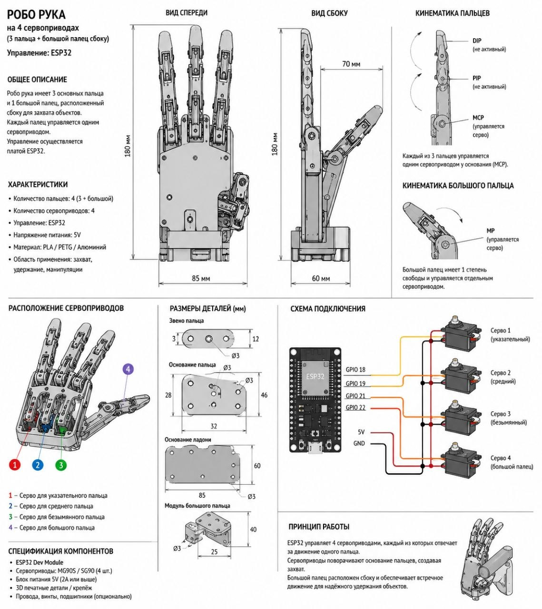

# Роботизированная кисть руки с веб-интерфейсом

## 0. Web-интерфейс

WEB-интерфейс (на этапе прототипа) содержит две кнопки: **СЖАТЬ** и **РАЗЖАТЬ**

Для его использования а данный момент нужно:
### Шаг 1:
Установить необходимые фреймворки:
``` bash
pip install flask flask-socketio eventlet
```
### Шаг 2:
Запустить сайт локально на устройстве:
``` bash
python ./site/app.py
```

### Шаг 3:
Открыть сайт в браузере:
``` 
localhost:5000
```

## 1. Общее описание проекта

Данный проект представляет собой прототип роботизированной кисти руки с упрощённой конструкцией. Управление кистью осуществляется дистанционно через интерактивный веб-интерфейс по сети Wi-Fi. 

Кисть имеет **четыре пальца** (три основных и один большой палец сбоку), которые двигаются синхронно — все пальцы одновременно сжимаются и разжимаются.

## 2. Механическая конструкция



### Конструкция пальцев:
- **3 основных пальца** расположены параллельно друг другу
- **1 большой палец** размещён сбоку для обеспечения захвата
- Каждый палец состоит из **двух фаланг**, соединённых шарнирами
- Все пальцы приводятся в движение отдельными сервоприводами

### Принцип действия:
По внутренней стороне каждого пальца проходит прочная нерастяжимая нить (кевларовая или рыболовная леска 0.3-0.5 мм). Нить крепится непосредственно к качалке (рычагу) сервопривода. 

**При повороте вала сервопривода:**
- Нить натягивается
- Последовательно сгибает фаланги пальца
- Палец переходит в согнутое состояние (захват)

**На тыльной (внешней) стороне каждого сустава** установлены возвратные пружины:
- При натяжении нити сервоприводом пружины сжимаются
- При ослаблении нити пружины разжимаются и возвращают палец в исходное выпрямленное состояние

### Используемые сервоприводы:
- **MG90S** (металлические шестерни, крутящий момент 1.8 кг·см)
- Или **SG90** (пластиковые шестерни, крутящий момент 1.6 кг·см) — более бюджетный вариант

## 3. Электронная архитектура

### Микроконтроллер:
Устройство работает под управлением микроконтроллера **ESP32** (или ESP8266 для более бюджетной версии).

### Питание:
- **ESP32**: запитывается от стандартного USB-порта (5В) или внешнего источника 5В через вывод VIN
- **Сервоприводы**: запитываются напрямую от внешнего блока питания 5В с током нагрузки не менее 2А
- **Важно**: Общая земля (GND) должна быть соединена между ESP32, блоком питания сервоприводов и самими сервоприводами

### Схема подключения:

| Компонент | Пин ESP32 | Примечание |
|-----------|-----------|------------|
| Сервопривод 1 (палец 1) | GPIO 9 (или D2) | Сигнал |
| Сервопривод 2 (палец 2) | GPIO 10 (или D3) | Сигнал |
| Сервопривод 3 (палец 3) | GPIO 11 (или D4) | Сигнал |
| Сервопривод 4 (большой палец) | GPIO 12 (или D5) | Сигнал |
| Кнопка (опционально) | GPIO 2 | INPUT_PULLUP |
| GND | GND | Общая земля |
| VCC (ESP32) | 5V/3.3V | Питание контроллера |

### Рекомендации по питанию:
```
Внешний блок питания 5В 2А+
         │
    ┌────┴─────┐
    │          │
  ESP32     Сервоприводы
 (через      (напрямую)
  VIN/5V)
```

**Важно**: Не подключайте сервоприводы к пину 5V на ESP32 — это может повредить контроллер!

## 4. Программная архитектура

### Веб-интерфейс:
Устройство запускает встроенный веб-сервер на порту 80. Пользователь может подключиться к кисти через любой браузер (смартфон, планшет, компьютер).

**Функционал веб-интерфейса:**
- Две основные кнопки: "ОТКРЫТЬ" (✋) и "ЗАКРЫТЬ" (✊)
- Визуальная индикация текущего состояния
- Отображение IP-адреса устройства
- Адаптивный дизайн для мобильных устройств

### Логика работы:

**Режим "Открыто":**
```cpp
servo1.write(0);   // Все сервоприводы
servo2.write(0);   // устанавливаются в 
servo3.write(0);   // положение 0 градусов
servo4.write(0);   // (пальцы выпрямлены)
```

**Режим "Закрыто":**
```cpp
servo1.write(90);  // Все сервоприводы
servo2.write(90);  // устанавливаются в 
servo3.write(90);  // положение 90 градусов
servo4.write(90);  // (пальцы согнуты)
```

### Настройка WiFi:
При первом запуске (или при отсутствии сохранённых данных) устройство работает в режиме точки доступа (AP Mode):
1. ESP32 создаёт сеть с именем "RoboticHand_AP"
2. При подключении открывается веб-страница для ввода SSID и пароля домашней сети
3. Данные сохраняются в энергонезависимой памяти (NVS)
4. Устройство перезагружается и подключается к домашней сети

## 5. Беспроводные протоколы и управление

### WiFi подключение:
Устройство подключается к стандартной WiFi сети 2.4 ГГц (протокол 802.11 b/g/n).

**Параметры сети:**
- Частота: 2.4 ГГц
- Диапазон IP: DHCP (автоматическое получение)
- Порт: 80 (HTTP)

### Протокол обмена:
- **HTTP GET запросы** для управления
-Endpoints:
  - `GET /` — главная страница (веб-интерфейс)
  - `GET /open` — команда открыть руку
  - `GET /close` — команда закрыть руку

**Пример запроса:**
```
http://192.168.1.100/open
```

**Ответ сервера:**
```
Рука открыта ✓
```

### Время отклика:
- Задержка между нажатием кнопки и движением: 50-200 мс
- Время полного открытия/закрытия: 1-2 секунды (зависит от скорости сервоприводов)

## 6. Калибровка и настройка

### Калибровка углов:
В коде предусмотрены константы для настройки углов:
```cpp
#define ANGLE_OPEN 0    // Угол открытого положения
#define ANGLE_CLOSE 90  // Угол закрытого положения
```

**Рекомендации:**
- Если пальцы не полностью выпрямляются — уменьшите `ANGLE_OPEN` (до 10-20°)
- Если пальцы не полностью сжимаются — увеличьте `ANGLE_CLOSE` (до 100-120°)
- Максимальный диапазон сервоприводов MG90S: 0-180°

### Настройка скорости:
Для плавности движения можно добавить задержку между шагами:
```cpp
for (int pos = 0; pos <= 90; pos++) {
  servo1.write(pos);
  servo2.write(pos);
  servo3.write(pos);
  servo4.write(pos);
  delay(15); // Задержка между шагами
}
```

## 7. Комплектующие

### Основные компоненты:

| Компонент | Количество | Примерная цена | Примечание |
|-----------|------------|----------------|------------|
| **ESP32 NodeMCU** (30 или 38 пинов) | 1 шт. | 510 ₽ | ChipDip, AliExpress |
| **Сервопривод MG90S** | 4 шт. | 360 ₽/шт. | Металлические шестерни |
| **Сервопривод SG90** (альтернатива) | 4 шт. | 150 ₽/шт. | Пластиковые шестерни |
| **Внешний блок питания 5В 2А+** | 1 шт. | 300 ₽ | USB зарядка или лабораторный БП |
| **Кнопка тактовая** (опционально) | 1 шт. | 10 ₽ | Для локального управления |
| **Нерастяжимая нить** (кевлар) | 2 м | 100 ₽ | Или рыболовная леска 0.3-0.5 мм |
| **Пружины возвратные** | 4 шт. | 50 ₽/шт. | Диаметр 3-5 мм, длина 10-15 мм |

### Дополнительные материалы:
- **Пластик PLA/PETG** для 3D-печати — 100 г
- **Винты M3** (разной длины) — 10-15 шт.
- **Провода Dupont** (папа-папа, папа-мама) — 10-15 шт.
- **Термоусадка** для изоляции соединений
- **Конденсатор 470-1000 мкФ** (рекомендуется для стабильности питания сервоприводов)

### Инструменты:
- 3D-принтер (для печати деталей корпуса)
- Паяльник (для подключения проводов)
- Отвёртка крестовая (для сборки)
- Кусачки/ножницы (для нити)
- Мультиметр (для проверки соединений)

## 8. Сборка и монтаж

### Этапы сборки:

**1. Печать деталей:**
- Распечатайте все детали корпуса на 3D-принтере
- Материал: PLA или PETG
- Заполнение: 20-40%
- Толщина стенок: 1.2-1.6 мм

**2. Установка сервоприводов:**
- Закрепите сервоприводы в посадочных местах
- Используйте винты M3 (обычно идут в комплекте с сервоприводами)
- Убедитесь, что валы сервоприводов свободно вращаются

**3. Монтаж пальцев:**
- Соберите фаланги пальцев на шарнирах
- Установите возвратные пружины на тыльной стороне суставов
- Протяните нить через направляющие отверстия

**4. Подключение нити:**
- Закрепите один конец нити на кончике пальца
- Пропустите через все направляющие
- Закрепите на качалке сервопривода
- Натяжение должно быть средним (не перетягивайте!)

**5. Электромонтаж:**
- Подключите сигнальные провода сервоприводов к ESP32
- Соедините все земли (GND)
- Подключите питание сервоприводов от внешнего источника
- Установите конденсатор параллельно питанию сервоприводов

**6. Тестирование:**
- Загрузите прошивку в ESP32
- Подайте питание
- Проверьте подключение к WiFi
- Протестируйте открытие/закрытие через веб-интерфейс

## 9. Прошивка и настройка

### Необходимое ПО:
- **Arduino IDE** (версия 1.8.x или новее)
- **ESP32 Board Manager** (устанавливается через Preferences → Additional Board Manager URLs)

### Установка ESP32 в Arduino IDE:

1. Откройте **File → Preferences**
2. В поле "Additional Board Manager URLs" добавьте:
   ```
   https://dl.espressif.com/dl/package_esp32_index.json
   ```
3. Откройте **Tools → Board → Boards Manager**
4. Найдите "esp32" и установите
5. Выберите плату: **DOIT ESP32 DEVKIT V1**

### Библиотеки:
Требуемые библиотеки встроены в Arduino IDE:
- `WiFi.h` (для ESP32)
- `WebServer.h`
- `Servo.h`

### Загрузка прошивки:

1. Подключите ESP32 к компьютеру через USB
2. Откройте файл с кодом в Arduino IDE
3. Измените настройки WiFi:
   ```cpp
   const char* ssid = "YourWiFiName";
   const char* password = "YourWiFiPassword";
   ```
4. Выберите порт (Tools → Port)
5. Нажмите **Upload** (Ctrl+U)
6. Откройте **Serial Monitor** (115200 baud)
7. Скопируйте IP-адрес из консоли
8. Откройте браузер: `http://[IP_АДРЕС]`

## 10. Устранение неисправностей

### Проблема: Сервоприводы не двигаются
**Причины:**
- Недостаточное питание (проверьте блок питания)
- Не соединены земли (GND)
- Неправильное подключение пинов

**Решение:**
- Используйте блок питания 5В с током не менее 2А
- Проверьте все соединения GND
- Перепроверьте схему подключения

### Проблема: ESP32 не подключается к WiFi
**Причины:**
- Неверный SSID или пароль
- Слабый сигнал WiFi
- Сеть 5 ГГц (не поддерживается)

**Решение:**
- Проверьте правильность ввода данных
- Поднесите устройство ближе к роутеру
- Используйте сеть 2.4 ГГц

### Проблема: Веб-интерфейс не открывается
**Причины:**
- Неправильный IP-адрес
- Устройство не в той же сети
- Порт 80 заблокирован

**Решение:**
- Проверьте IP в Serial Monitor
- Убедитесь, что телефон/ПК в той же WiFi сети
- Попробуйте другой браузер

### Проблема: Пальцы двигаются рывками
**Причины:**
- Нехватка тока
- Слишком быстрая отправка команд
- Механическое сопротивление

**Решение:**
- Установите более мощный блок питания
- Добавьте задержки в код
- Проверьте свободу движения пальцев

## 11. Модернизация и улучшения

### Возможные улучшения:

**1. Датчики касания:**
- Установите тактовые кнопки или тензодатчики на кончики пальцев
- Реализуйте остановку при касании объекта

**2. Обратная связь по току:**
- Добавьте шунты (резисторы 1 Ом) в цепь питания каждого сервопривода
- Подключите к аналоговым пинам ESP32
- Реализуйте остановку при превышении тока (блокировка)

**3. Управление через Bluetooth:**
- Добавьте модуль HC-05/HC-06
- Реализуйте управление со смартфона

**4. ESP-NOW протокол:**
- Для управления с перчатки или пульта
- Прямая связь между ESP32 без роутера

**5. Автономное питание:**
- Добавьте Li-Po аккумулятор 7.4В
- Установите модуль зарядки TP4056
- Реализуйте индикацию заряда

**6. Улучшенный веб-интерфейс:**
- Добавьте слайдеры для точной регулировки
- Реализуйте сохранение позиций
- Добавьте логирование действий

## 12. Технические характеристики

### Общие параметры:
- **Напряжение питания**: 5В
- **Потребляемый ток**: 
  - В покое: 50-100 мА
  - При движении: 500-1000 мА
  - Пиковый: до 2000 мА
- **Рабочая температура**: 0...+40°C
- **Размеры кисти**: ~150 × 80 × 40 мм
- **Вес**: ~200-300 г

### Сервоприводы:
- **Модель**: MG90S
- **Крутящий момент**: 1.8 кг·см (4.8В)
- **Скорость**: 0.1 сек/60°
- **Угол поворота**: 0-180°
- **Ток покоя**: 10-20 мА
- **Ток движения**: 100-150 мА
- **Ток блокировки**: 400-500 мА

### Беспроводная связь:
- **Протокол**: WiFi 802.11 b/g/n
- **Частота**: 2.4 ГГц
- **Дальность**: до 30 м (в помещении)
- **Задержка**: 50-200 мс

### Программное обеспечение:
- **Платформа**: Arduino IDE
- **Язык**: C++
- **Размер прошивки**: ~300-500 КБ
- **Свободная память**: ~1.5 МБ

## 13. Безопасность

### Меры предосторожности:

**Электрическая безопасность:**
- Не подключайте сервоприводы напрямую к пинам 5V ESP32
- Всегда соединяйте земли (GND) всех компонентов
- Используйте предохранитель 2-3А в цепи питания
- Изолируйте все соединения термоусадкой

**Механическая безопасность:**
- Не допускайте попадания пальцев в движущиеся части
- Проверяйте надёжность крепления сервоприводов
- Не превышайте максимальный угол поворота сервоприводов
- Регулярно проверяйте целостность нитей

**Термическая безопасность:**
- Не оставляйте устройство без присмотра при длительной работе
- Обеспечьте вентиляцию ESP32 и сервоприводов
- При нагреве выше 60°C отключите питание
